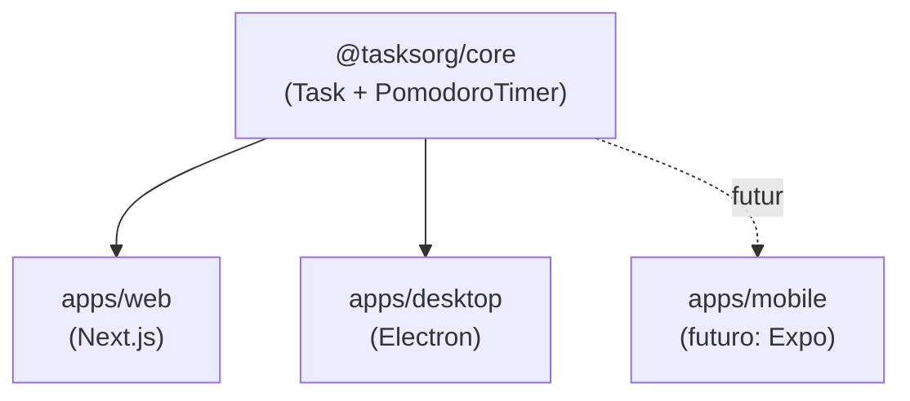

## Stack

| Camada | Tecnologia |
|---|---|
| Linguagem | TypeScript em 100% do código |
| Monorepo | pnpm workspaces + Turborepo |
| Web | Next.js 14 (App Router) + React 18 |
| Desktop | Electron 32 |
| Mobile | ainda não implementado — próximo passo: Expo (React Native) |
| Lógica compartilhada | pacote `@tasksorg/core`, sem nenhuma dependência de UI |
| Testes | Vitest (packages/core) |
| Containers | Docker + Docker Compose |
| CI/CD | Jenkins (Jenkinsfile) |
| Orquestração (futuro) | Kubernetes |

## Estrutura do monorepo

```
TasksOrganization/
├── apps/
│   ├── web/        → Next.js (roda no navegador)
│   │   ├── Dockerfile      → imagem de PRODUÇÃO (multi-stage)
│   │   └── Dockerfile.dev  → imagem de DESENVOLVIMENTO (bind mount)
│   └── desktop/     → Electron (empacota a web/lógica num app nativo)
├── packages/
│   └── core/         → Regras de negócio compartilhadas (tasks + pomodoro)
├── devops/
│   └── jenkins/       → imagem custom do Jenkins (Docker CLI + plugins)
├── docker-compose.yml → sobe o app web (bind mount) + o Jenkins
├── Jenkinsfile        → pipeline de CI/CD
├── turbo.json
├── pnpm-workspace.yaml
└── package.json
```

## Por que um monorepo?

Porque o core do projeto é rodar em várias plataformas com o mesmo comportamento. Colocar tudo num único repositório com pacotes compartilhados evita duplicar regra de negócio (tipos de tarefa, lógica do pomodoro, etc.) em cada plataforma — e o Turborepo garante que só se rebuilda o que mudou.

## `packages/core` — o coração compartilhado

Contém, sem nenhuma dependência de React/DOM/Electron:

- `task.ts` — modelo de `Task` (escopo diário/semanal/anual, status, prioridade) e um `TaskStore` em memória.
- `pomodoro.ts` — uma máquina de estados `PomodoroTimer` (foco → pausa curta → pausa longa), agnóstica de como o tempo é avançado.

É o que a Web e o Desktop importam e usam da mesma forma — prova de conceito de que dá pra compartilhar lógica de verdade entre plataformas. 13 testes unitários (Vitest) cobrindo essa lógica.



## Como rodar localmente

Pré-requisitos: Node 20+ e pnpm (`corepack enable`).

```bash
pnpm install

# roda tudo (lint, typecheck, test, build) em todos os pacotes
pnpm build && pnpm test && pnpm lint && pnpm typecheck

# desenvolvimento
pnpm --filter @tasksorg/web dev       # Next.js em http://localhost:3000
pnpm --filter @tasksorg/desktop dev   # builda e abre a janela do Electron
```

Decisões de arquitetura registradas com mais contexto em: [[🗳️ Decisões]]
