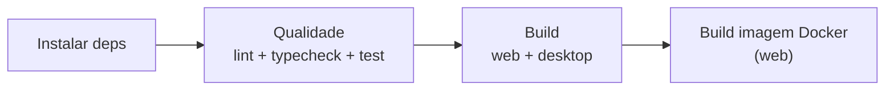

Ferramentas definidas pelo grupo: **Docker** + **GitLab CI/CD** (auto-hospedado), **Kubernetes** numa próxima etapa. Detalhes completos (comandos exatos) ficam no `README.md` do repositório — aqui é o resumo de arquitetura e o porquê de cada escolha.

> [!warning] 13/09/2026
> o time trocou o **Jenkins** pelo **GitLab CI/CD** (auto-hospedado). A seção "Jenkins" abaixo fica documentada como referência histórica (foi implementado e validado de verdade) até a migração pro GitLab estar pronta no código — ver seção **GitLab CI/CD** logo depois.

## Docker

O app **web** roda em container de duas formas diferentes.

### Desenvolvimento (com bind mount)

`apps/web/Dockerfile.dev` + `docker-compose.yml` fazem um **bind mount** da pasta do projeto pra dentro do container: o código é editado normalmente no host, e o container enxerga a mudança na hora (hot reload), sem rebuildar nada.

```bash
docker compose up -d --build web
```

Abre em `http://localhost:3000`.

O bind mount é a linha `.:/app` do `docker-compose.yml`. As linhas de volumes anônimos logo abaixo (`/app/node_modules`, etc.) existem só pra proteger o `node_modules` de dentro do container (Linux) de ser sobrescrito pelo `node_modules` do host (Windows), que teria binários incompatíveis.

### Produção (imagem final, sem bind mount)

`apps/web/Dockerfile` faz um build multi-stage (deps → builder → runner) e gera uma imagem enxuta e autossuficiente — essa é a imagem que o Jenkins constrói no pipeline.

```bash
docker build -f apps/web/Dockerfile -t tasksorg-web .
docker run -p 3000:3000 tasksorg-web
```

> [!info]
> O **desktop (Electron) não é containerizado** — precisa de interface gráfica pra rodar de verdade, o que não faz sentido dentro de um container de CI.

## Jenkins *(substituído — ver GitLab CI/CD abaixo)*

Roda em container (`devops/jenkins/Dockerfile`), com Docker CLI já instalado e os plugins necessários pré-configurados (`devops/jenkins/plugins.txt`). Recebe, via bind mount, o **socket do Docker do host** (`/var/run/docker.sock`) — padrão conhecido como **"Docker outside of Docker" (DooD)**, é assim que um Jenkins rodando dentro de um container consegue mandar o Docker do host buildar outras imagens.

```bash
docker compose up -d --build jenkins
docker compose exec jenkins cat /var/jenkins_home/secrets/initialAdminPassword
```

Abra `http://localhost:7000` (mapeado no `docker-compose.yml` — o Jenkins escuta na 8080 *dentro* do container). Crie um job **Pipeline** e cole o `Jenkinsfile` do repositório.

### O que o Jenkinsfile faz

Substitui o antigo `.github/workflows/ci.yml` (removido). Cada stage roda num container `node:20` efêmero, pedido pelo Jenkins ao Docker do host:

1. **Instalar dependências** — `pnpm install --frozen-lockfile`
2. **Qualidade** — `lint`, `typecheck` e `test` em todo o monorepo
3. **Build (web + desktop)** — `turbo run build` nos dois pacotes
4. **Build da imagem Docker (web)** — roda no próprio container do Jenkins (não num `node:20` efêmero), porque é ele quem tem acesso ao Docker do host



## Problemas comuns (troubleshooting)

<details>
<summary>"ports are not available" / erro de bind na porta ao subir o Jenkins</summary>

Outro processo já está usando a porta do host. No Windows: `netstat -ano | findstr :7000` pra achar o PID, depois `Get-CimInstance Win32_Process -Filter "ProcessId = <PID>"` pra identificar o processo. Se for um Jenkins nativo (fora do Docker) rodando como serviço do Windows: `Get-Service Jenkins` pra confirmar, `Stop-Service -Name "Jenkins"` num PowerShell **como administrador** pra parar (fora de um terminal elevado dá erro `CouldNotStopService`), e `Set-Service -Name "Jenkins" -StartupType Manual` pra não voltar a subir sozinho.

</details>

<details>
<summary>"docker volume rm ... no such volume"</summary>

O nome do volume pode não bater com o esperado dependendo da versão do Docker Compose. Em vez de adivinhar, use `docker compose down -v` (remove os volumes do projeto atual automaticamente) ou confira o nome real com `docker volume ls`.

</details>

<details>
<summary>Esqueceu a senha do admin do Jenkins</summary>

Mais simples pra ambiente de estudo/POC sem jobs importantes ainda: `docker compose down -v` seguido de `docker compose up -d --build jenkins` reseta tudo e gera senha inicial nova. Pra resetar SEM perder jobs já configurados, desligue a segurança temporariamente editando `/var/jenkins_home/config.xml` (`useSecurity` para `false`), reinicie o container, reconfigure em Manage Jenkins → Security — detalhes no README.

</details>

## GitLab CI/CD *(planejado — ainda não implementado)*

Substitui o Jenkins. Decisão: **GitLab CE auto-hospedado** (em Docker, não o GitLab.com na nuvem) — mesmo espírito do setup anterior do Jenkins.

> [!info]
> Ainda não implementado no código. Esta seção descreve o plano; os detalhes exatos (comandos, docker-compose) entram aqui quando a implementação começar.

### Plano

- **GitLab CE** rodando em container próprio via `docker-compose.yml` (substituindo o serviço `jenkins` de lá) — bem mais pesado que o Jenkins em RAM/CPU/disco, então vale reservar recursos.
- Um **GitLab Runner** com acesso ao Docker do host (mesmo padrão *Docker outside of Docker* usado no Jenkins) pra conseguir buildar a imagem `tasksorg-web`.
- Um `.gitlab-ci.yml` na raiz do repositório, espelhando os stages que o `Jenkinsfile` já tinha:


- Remover do repositório: `Jenkinsfile`, `devops/jenkins/` e o serviço `jenkins` do `docker-compose.yml`.

Decisão completa com contexto: [[🗳️ Decisões]]

## Kubernetes (próxima etapa)

Ainda **não implementado**. Plano: escrever manifests (`k8s/deployment.yaml`, `k8s/service.yaml`) pra imagem `tasksorg-web` e adicionar um stage `kubectl apply` no fim do `.gitlab-ci.yml`. Pra testar localmente: Docker Desktop (tem Kubernetes embutido) ou k3d/kind. Depende de antes publicar a imagem num registry (Docker Hub, GHCR ou o GitLab Container Registry) — hoje o pipeline só builda local.

Decisões completas com contexto: [[🗳️ Decisões]]
